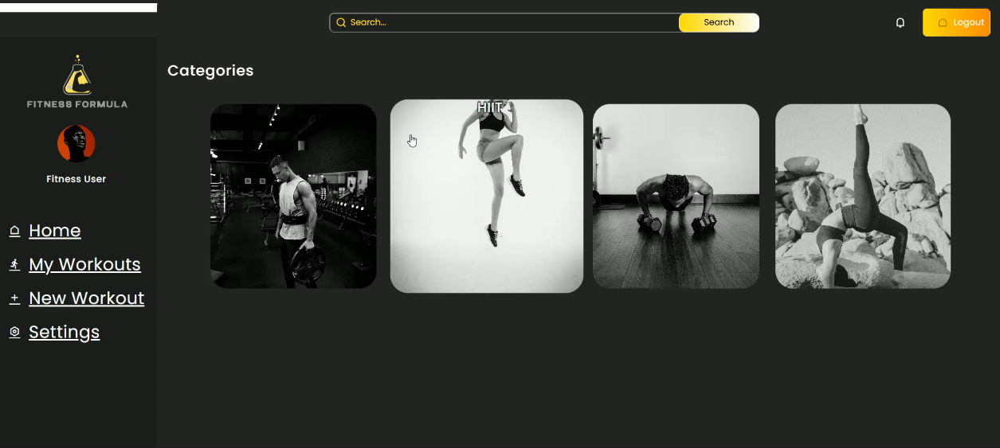
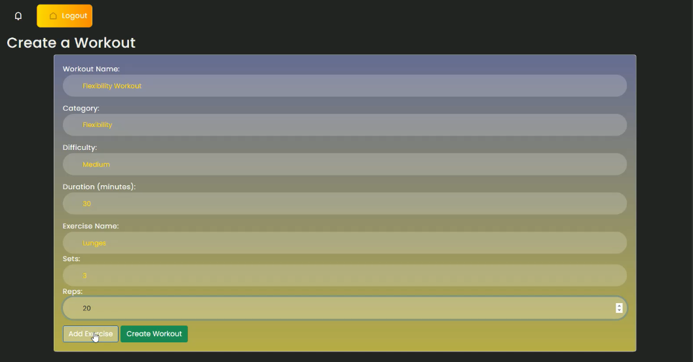

FitnessFormula

Introduction:

- FitnessFormula is a Web Application tailored to give fitness enthusiasts power to create their own workouts. At FitnessFormula, we understand that each individual has unique fitness needs and preferences. Our platform leverages advanced algorithms and user input to design bespoke training programs that cater to your specific goals, be it weight loss, muscle gain, endurance improvement, or overall wellness.

Deployed link = [Access-here](https://web.fitnessformula.al-code.tech/)

FitnessFormula Article from Aerin Lombard = https://www.linkedin.com/posts/aerin-lombard_how-we-built-fitnessformula-activity-7216066517879164932-xkcZ

Authors:

- Team Lead and Backend Engineer = Aerin Lombard https://www.linkedin.com/in/aerin-lombard/

- Design Lead and Frontend Engineer = Khehla Dlamini https://www.linkedin.com/in/khehla-dlamini-debugs/

Installation:

To get a copy locally, follow these steps:

1. **Clone the repository**
git clone https://github.com/AerinLom/FitnessFormula-API.git

2. **Navigate to the project's directory**
cd FitnessFormula-API/FitnessFormulaMVP

3. **Download and install the .NET 8.0 SDK**
wget https://dot.net/v1/dotnet-install.sh -O dotnet-install.sh
chmod +x dotnet-install.sh
./dotnet-install.sh --channel 8.0 --install-dir /usr/share/dotnet

4. **Add the .NET SDK to the PATH**
export PATH=$PATH:/usr/share/dotnet

5. **Restore the project dependencies**
dotnet restore

6. **Build the project**
dotnet build

7. **Publish the project**
dotnet publish -c Release -o /home/ubuntu/publish/FitnessFormulaMVP

8. **Run the application**
dotnet /home/ubuntu/publish/FitnessFormulaMVP/FitnessFormula.dll

Usage:

1. **Login/Sign Up:**
   - Navigate to the login/signup page.
   - Enter your credentials to log in or sign up if you're a new user.

2. **Search Workouts:**
   - Use the search functionality to find specific workouts.
   - Enter keywords to refine your search.

3. **Create Workouts:**
   - Access the "Create Workout" feature from the dashboard.
   - Specify exercises, sets, and reps for your custom workout.
   - Save the workout once you've finished creating it.

4. **Sort Workouts by Category:**
   - On the main workout page, utilize the category sorting options.
   - Choose from categories such as strength, flexibility, etc., to filter workouts.

5. **Save and View Workouts:**
   - Save workouts you create or find to your profile.
   - Access saved workouts from "My Workouts" on the dashboard.
   - View detailed information about each workout, including exercises and descriptions.

Contributions:

Contributions are what make the open-source community such an amazing place to learn, inspire and create. Any contributions you make are greatly appreciated.

To contribute, do the following:

1. Fork the project.

2. Create your Feature branch.

3. Commit your changes.

4. Push to the branch.

5. Open a pull request.

Related Projects:

1. AI-Based-Health-Tracker - https://github.com/sauhard2701/AI-Based-Health-Tracker.git 

2. health_tracker - https://github.com/AnisDhia/health_tracker.git

License:

- This project is licensed under the terms of the MIT license.
